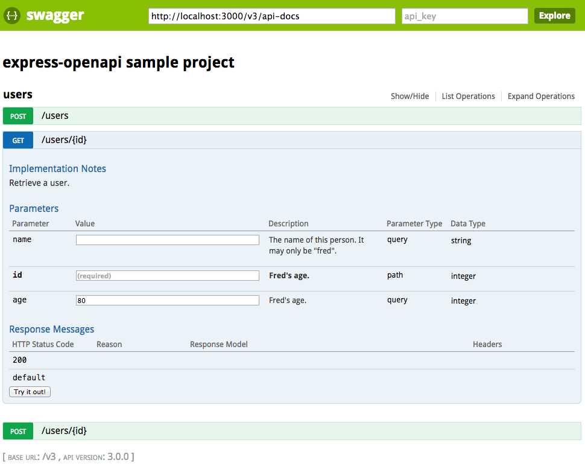

# express-openapi [![NPM version][npm-image]][npm-url] [![Downloads][downloads-image]][npm-url] [![Build Status][travis-image]][travis-url] [![Coveralls Status][coveralls-image]][coveralls-url]
> Effortlessly add routes and middleware to express apps with openapi documents.

## Highlights

* Utilizes convention based programming.
* Unobtrusively opinionated.
* Stays as close to `express` as possible.
* Leverages openapi parameter lists for parameter defaults, type coercion,
and validation in your app's express routes.
  * See [express-openapi-defaults](https://github.com/kogosoftwarellc/express-openapi-defaults)
  * See [express-openapi-coercion](https://github.com/kogosoftwarellc/express-openapi-coercion)
  * See [express-openapi-validation](https://github.com/kogosoftwarellc/express-openapi-validation)
* Leverages openapi response definitions to provide `res.validateResponse` tailored to a particular route.
  * See [express-openapi-response-validation](https://github.com/kogosoftwarellc/express-openapi-response-validation)
* Validates api documents.
  * See [openapi-schema-validation](https://github.com/kogosoftwarellc/openapi-schema-validation)
* Performant.
* Extensively tested.
* Small footprint.
* Currently supports openapi 2.0 (a.k.a. swagger 2.0) documents.
* Conforms to the [single responsibility principle](https://en.wikipedia.org/wiki/Single_responsibility_principle)
wherever possible.
* Clean interface.
* Adds a route for Swagger UI (`apiDoc.basePath` + `args.docsPath`).

## Example

Let's use the sample project located at [./test/sample-projects/basic-usage/](
https://github.com/kogosoftwarellc/express-openapi/tree/master/test/sample-projects/basic-usage).

The project layout looks something like this:


Here's how we add our routes to express:

```javascript
var app = require('express')();
var bodyParser = require('body-parser');
var openapi = require('express-openapi');
var cors = require('cors');

app.use(cors());
app.use(bodyParser.json());

openapi.initialize({
  apiDoc: require('./api-doc.js'),
  app: app,
  routes: './api-routes'
});

app.use(function(err, req, res, next) {
  res.status(err.status).json(err);
});

app.listen(3000);
```

Our routes are now active and we can test them out with Swagger UI:



Check out the other sample projects for complete usage examples.

## API

### .initialize(args)

Initializes routes and middleware on an express app.

#### args.apiDoc

|Type|Required|Description|
|----|--------|-----------|
|Object|Y|This is an openapi (swagger 2.0) compliant document.  See the [OpenAPI-Specification](https://github.com/OAI/OpenAPI-Specification/blob/master/versions/2.0.md) for more details.|

`args.apiDoc.paths` should be an empty object.  `express-openapi` will populate this
for you.  This prevents you from defining your paths in 2 places.

`args.apiDoc.basePath` will add a prefix to all routes added by `express-openapi`.

`args.apiDoc.definitions` will be used for de-referencing `$ref` properties in
parameters.

#### args.app

|Type|Required|Description|
|----|--------|-----------|
|Object|Y|The express app you wish to initialize.|

#### args.routes

|Type|Required|Description|
|----|--------|-----------|
|String|Y|A path to the directory that contains your route files.|


Route files are logically structured according to their URL path.

For example, if you have the following routes that you wish to add to your express
app:

```
GET /v1/users/:id
POST /v1/users
```

You would define `basePath: '/v1'` in your `apiDoc`, and layout your `routes` directory
as follows:

```
<project>
        `routes/
               `users/
                     `:id.js
                users.js
```

The contents of `<project>/routes/users/:id.js` would look like this:

```javascript
module.exports = {
  get: [
    /* business middleware not expressible by openapi documentation goes here */
    function(req, res, next) {
      var validationError = res.validateResponse(200, /* return the user or an error */);

      if (validationError)
        return next(validationError);
      }

      res.status(200).json(/* return the user or an error */);
    }
  ]
};

module.exports.get.apiDoc = {
  description: 'A description for retrieving a user.',
  tags: ['users'],
  operationId: 'getUser',
  parameters: [
    {
      in: 'path',
      name: 'id',
      required: true,
      type: 'integer'
    }
  ],
  responses: {
    default: {
      $ref: '#/definitions/Error'
    }
  }
};

```

Modules under `args.routes` expose methods.  Methods may either be a method handler
function, or an array of business specific middleware + a method handler function.

`express-openapi` will prepend middleware to this stack based on the parameters
defined in the method's `apiDoc` property.  If no `apidoc` property exists on the
module method, then `express-openapi` will add no additional middleware.

#### args.docsPath

|Type|Required|Default Value|Description|
|----|--------|-----------|----|
|String|N|/api&#8209;docs|Sets the path that Swagger UI will use to request `args.apiDoc` with populated paths.  You can use this to support multiple versions of your app.|

#### args.errorTransformer

|Type|Required|Description|
|----|--------|-----------|
|Function|N|Transforms errors to a standard format as defined by the application.  See [express-openapi-validation#args.errorTransformer](https://github.com/kogosoftwarellc/express-openapi-validation#argserrortransformer) for more info.|

#### args.exposeApiDocs

|Type|Required|Default Value|Description|
|----|--------|-----------|-------|
|Boolean|N|true|Adds a route at `args.apiDoc.basePath` + `args.docsPath`.  The route will respond with `args.apiDoc`.|

#### args.validateApiDoc

|Type|Required|Default Value|Description|
|----|--------|-----------|-------|
|Boolean|N|true|Validates `args.apiDoc` before and after path population.  This does not effect individual route validation of route parameters.  You can disable this behavior by passing `false`.|


## LICENSE
``````
The MIT License (MIT)

Copyright (c) 2016 Kogo Software LLC

Permission is hereby granted, free of charge, to any person obtaining a copy
of this software and associated documentation files (the "Software"), to deal
in the Software without restriction, including without limitation the rights
to use, copy, modify, merge, publish, distribute, sublicense, and/or sell
copies of the Software, and to permit persons to whom the Software is
furnished to do so, subject to the following conditions:

The above copyright notice and this permission notice shall be included in
all copies or substantial portions of the Software.

THE SOFTWARE IS PROVIDED "AS IS", WITHOUT WARRANTY OF ANY KIND, EXPRESS OR
IMPLIED, INCLUDING BUT NOT LIMITED TO THE WARRANTIES OF MERCHANTABILITY,
FITNESS FOR A PARTICULAR PURPOSE AND NONINFRINGEMENT. IN NO EVENT SHALL THE
AUTHORS OR COPYRIGHT HOLDERS BE LIABLE FOR ANY CLAIM, DAMAGES OR OTHER
LIABILITY, WHETHER IN AN ACTION OF CONTRACT, TORT OR OTHERWISE, ARISING FROM,
OUT OF OR IN CONNECTION WITH THE SOFTWARE OR THE USE OR OTHER DEALINGS IN
THE SOFTWARE.
``````

[downloads-image]: http://img.shields.io/npm/dm/express-openapi.svg
[npm-url]: https://npmjs.org/package/express-openapi
[npm-image]: http://img.shields.io/npm/v/express-openapi.svg

[travis-url]: https://travis-ci.org/kogosoftwarellc/express-openapi
[travis-image]: http://img.shields.io/travis/kogosoftwarellc/express-openapi.svg

[coveralls-url]: https://coveralls.io/r/kogosoftwarellc/express-openapi
[coveralls-image]: http://img.shields.io/coveralls/kogosoftwarellc/express-openapi/master.svg
